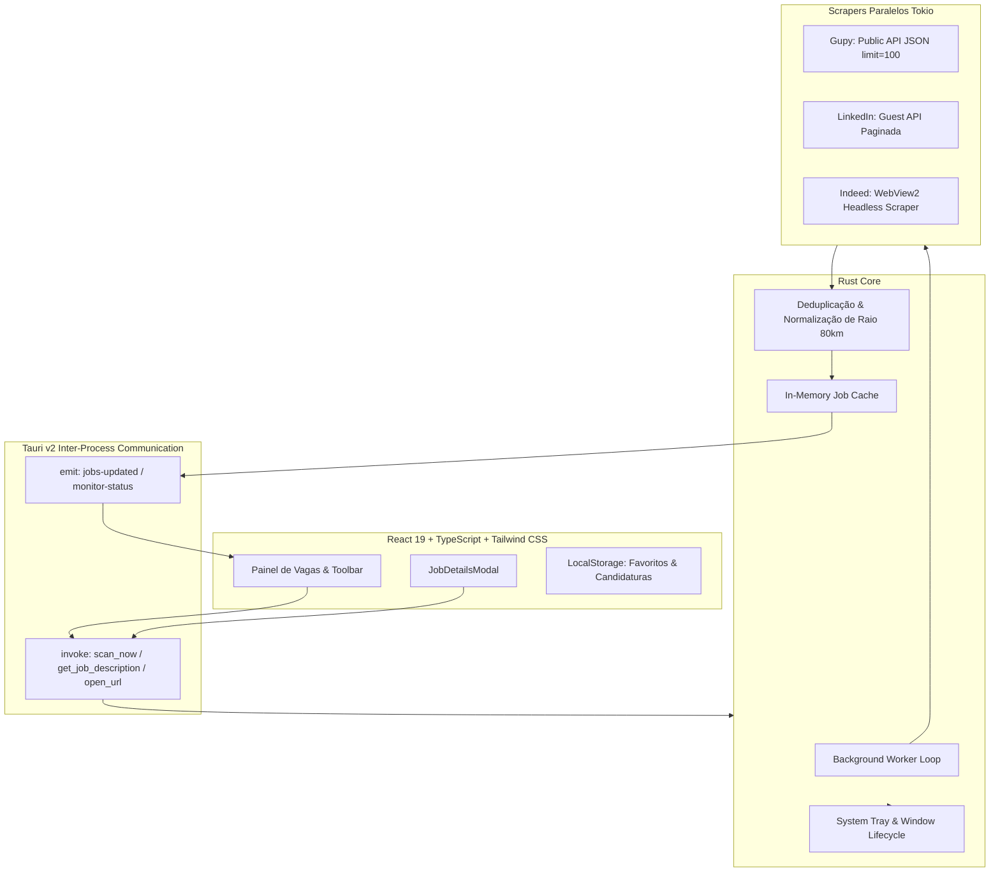

<div align="center">

# 💼 VagaFounder

**Monitor Desktop Inteligente de Oportunidades de Emprego em Tempo Real**

[](https://tauri.app/)
[](https://www.rust-lang.org/)
[](https://react.dev/)
[](https://www.typescriptlang.org/)
[](https://tailwindcss.com/)
[](LICENSE)

*Desenvolvido com foco em alta performance nativa, baixo consumo de memória e produtividade na busca por vagas de emprego.*

**by: MateusDeveleoper**

---

</div>

## 📌 Sobre o VagaFounder

O **VagaFounder** é uma aplicação desktop nativa desenvolvida com o ecossistema **Tauri v2 (Rust)** no backend e **React + TypeScript + Tailwind CSS** no frontend. 

A aplicação automatiza a busca e o monitoramento contínuo de vagas nas maiores plataformas de contratação do mercado — **Gupy**, **LinkedIn** e **Indeed** —, agregando centenas de oportunidades em uma interface limpa, unificada e altamente produtiva.

Com suporte a escopo geográfico regional (**Recife e região metropolitana em até 80 km**) e vagas **Remotas em todo o Brasil**, o VagaFounder filtra oportunidades para diferentes perfis profissionais: desde *Jovem Aprendiz*, *Estágio* e *Auxiliar Administrativo* até *Suporte de TI*, *Recursos Humanos (RH)* e *Desenvolvimento de Software*.

---

## ✨ Principais Funcionalidades

### 🚀 Varredura Paralela em Rust (Alta Performance)
* **Scraping Concorrente Assíncrono:** O backend em Rust dispara requisições concorrentes com controle de taxa (`tokio::sync::Semaphore`) para raspar simultaneamente Gupy, LinkedIn e Indeed.
* **Integração Gupy Pública:** Coleta direta via endpoint JSON com lotes paginados de `limit=100` e paginação sequencial (`offset=100`, `offset=200`).
* **LinkedIn Guest API Paginada:** Extração em lotes de 10 a 25 resultados por requisição (`start=0`, `start=25`, `start=50`, `start=75`) com extração de datas e links canônicos de inscrição.
* **Indeed WebView:** Extração de cards via motor de navegador headless para transpassar validações anti-robô e coletar lotes múltiplos (`start=0`, `start=10`, `start=20`).
* **Deduplicação Inteligente:** Algoritmo que indexa por identificadores únicos de vaga, preservando aberturas reais sem colapsar empresas com múltiplos cargos iguais.

### 🎯 Filtros Unificados em Linha Única (Toolbar Compacta)
* **Busca Textual em Tempo Real:** Filtre instantaneamente por palavra-chave no título, nome da empresa ou localidade.
* **Filtro de Período:** *Todas*, *Últimas 24h*, *Últimos 3 dias*, *Últimos 7 dias* e *Últimos 30 dias*.
* **Filtro de Local / Modalidade:** *Todos os Locais*, *Recife*, *Jaboatão dos Guararapes*, *Grande Recife (Raio 80km)*, *Apenas Presencial*, *Híbrido* e *Remoto (Home Office)*.
* **Filtro de Área / Cargo:** *Todos os Cargos*, *TI & Dev*, *Jovem Aprendiz*, *Estágio*, *Auxiliar Administrativo*, *Recursos Humanos (RH)*, *Suporte de TI* e *Atendimento / Recepção*.
* **Pills de Fonte Rápidas:** Alterne com um clique entre *Todas*, *LinkedIn*, *Gupy* e *Indeed*.

### 🔍 Modal de Detalhes da Vaga (Pré-visualização Sob Demanda)
* **Clique no Título da Vaga:** Abre um pop-up centralizado com backdrop suave e tipografia legível sem sair da aplicação.
* **Carregamento Híbrido:** Exibe a descrição já coletada no lote ou faz busca sob demanda em background via comando nativo (`get_job_description`).
* **Formatação Inteligente:** Suporte a textos com parágrafos, listas estruturadas e negritos sanitizados.
* **Acessibilidade:** Suporte a tecla `ESC` para fechar, clique fora do pop-up e bloqueio do scroll inferior durante a exibição.

### 📊 Paginação & Visualização Flexível
* **Controle de Paginação:** Navegação fluida no rodapé com seletor de registros por página (`[25 | 50 | 100]`), páginas numéricas dinâmicas e indicador *"Exibindo 1–25 de X vagas"*.
* **Alternador de Visualização:** Escolha entre **Modo Tabela Detalhada** e **Modo Grade / Cards**.
* **Gestão de Candidaturas:** Ações rápidas para **Favoritar / Salvar Vaga**, marcar como **"Já me candidatei"** e **Ocultar Vagas**.

### 🔔 Execução em Segundo Plano & Bandeja do Sistema (Tray)
* **Monitoramento Contínuo:** Varreduras em background automáticas a cada 15 minutos sem consumir CPU desnecessária.
* **System Tray Nativo:** Fechar a janela principal oculta o aplicativo para a bandeja do sistema (Windows/macOS/Linux) em vez de encerrar o processo.
* **Menu de Contexto do Tray:**
  - *Abrir Painel* (traz a janela para foco).
  - *Pausar / Retomar Monitoramento*.
  - *Verificar Vagas Agora* (varredura instantânea).
  - *Sair* (encerra o aplicativo definitivamente).
* **Notificações do Sistema:** Alertas nativos no Windows/Linux/macOS sempre que novas vagas compatíveis forem encontradas.

---

## 🏗️ Arquitetura do Sistema



---

## 🛠️ Tecnologias Utilizadas

| Camada | Tecnologia | Descrição |
|---|---|---|
| **Shell Nativo** | [Tauri v2](https://tauri.app/) | Runtime desktop ultra-leve baseado em WebView2 (Windows) e WebKit (Linux/macOS) |
| **Backend** | [Rust](https://www.rust-lang.org/) | Concorrência segura, parsing assíncrono e baixo consumo de recursos |
| **Scraping & HTTP** | [Reqwest](https://docs.rs/reqwest/) + [Scraper](https://docs.rs/scraper/) | Requisições HTTP com keep-alive e seletores CSS |
| **Frontend** | [React 19](https://react.dev/) | Construção declarativa da interface |
| **Linguagem Frontend** | [TypeScript](https://www.typescriptlang.org/) | Tipagem estrita ponta a ponta |
| **Estilização** | [Tailwind CSS v3](https://tailwindcss.com/) | Sistema de design moderno, limpo e responsivo |
| **Ícones & Datas** | [Lucide React](https://lucide.dev/) + [Date-fns](https://date-fns.org/) | Ícones consistentes e formatação de datas em pt-BR |
| **Bundler** | [Vite 5](https://vitejs.dev/) | HMR instantâneo e compilação otimizada |

---

## 📦 Como Instalar e Rodar Localmente

### Pré-requisitos
1. **Node.js**: versão 18 ou superior.
2. **Rust & Cargo**: versão estável recomendada ([instalar via rustup](https://rustup.rs/)).
3. **Dependências do Tauri para o seu sistema:**
   - **Windows:** Microsoft C++ Build Tools e WebView2 (já incluso no Windows 10/11).
   - **Linux (Ubuntu/Debian):** `sudo apt update && sudo apt install -y libwebkit2gtk-4.1-dev build-essential curl wget file libssl-dev libappindicator3-dev librsvg2-dev`
   - **macOS:** Xcode Command Line Tools (`xcode-select --install`).

### Passo a Passo

1. **Clone o repositório:**
   ```bash
   git clone https://github.com/mssmateusdev/vagafounder-app.git
   cd vagafounder-app
   ```

2. **Instale as dependências do frontend:**
   ```bash
   npm install
   ```

3. **Inicie em modo de desenvolvimento:**
   ```bash
   npm run tauri dev
   ```
   *O Vite iniciará o servidor local e o Tauri compilará o backend Rust abrindo a janela do aplicativo.*

---

## 🔨 Como Gerar os Instaladores (Build de Produção)

### Build Local (Windows)
Para gerar o instalador executável (`.exe`) e o pacote MSI no Windows:
```bash
npm run tauri:build
```
Os arquivos gerados ficarão disponíveis em:
- **Instalador NSIS (.exe):** `src-tauri/target/release/bundle/nsis/VagaFounder_1.0.0_x64-setup.exe`
- **Pacote MSI (.msi):** `src-tauri/target/release/bundle/msi/VagaFounder_1.0.0_x64_en-US.msi`

### Builds Multiplataforma (CI/CD Automático)
O projeto inclui um workflow de automação via **GitHub Actions** ([`.github/workflows/release.yml`](.github/workflows/release.yml)). Ao criar e enviar uma tag de versão:

```bash
git tag -a v1.0.0 -m "Release v1.0.0"
git push origin v1.0.0
```

O GitHub Actions compila automaticamente em máquinas virtuais dedicadas:
* 🪟 **Windows:** `.exe` (NSIS) e `.msi`
* 🐧 **Linux:** `.deb` e `.AppImage`
* 🍎 **macOS:** `.dmg` (Universal binary para chips Apple Silicon e Intel)

E disponibiliza os binários diretamente na aba [Releases](https://github.com/mssmateusdev/vagafounder-app/releases).

---

## 📁 Estrutura de Diretórios

```
vagafounder-app/
├── .github/
│   └── workflows/
│       └── release.yml          # Pipeline CI/CD para compilação multiplataforma
├── src/                         # Frontend React
│   ├── assets/                  # Imagens e vetores
│   ├── components/
│   │   └── JobDetailsModal.tsx  # Pop-up de pré-visualização e detalhes da vaga
│   ├── App.tsx                  # Dashboard principal, toolbar e tabela
│   ├── types.ts                 # Interfaces TypeScript (Job, Filter, MonitorStatus)
│   ├── main.tsx                 # Ponto de entrada React
│   └── index.css                # Estilos globais e Tailwind
├── src-tauri/                   # Backend Rust Tauri
│   ├── src/
│   │   ├── sources/             # Módulos de busca e scraping
│   │   │   ├── gupy.rs          # Scraper e integração com API pública do Gupy
│   │   │   ├── linkedin.rs      # Scraper paginado da Guest API do LinkedIn
│   │   │   ├── indeed.rs        # Scraper headless via WebView do Indeed
│   │   │   └── mod.rs           # Cliente HTTP global e timeouts
│   │   ├── lib.rs               # Estado global, IPC commands e background worker
│   │   ├── tray.rs              # Configuração do System Tray e menu nativo
│   │   ├── util.rs              # Classificação de cargos, raio de 80km e deduplicação
│   │   └── main.rs              # Ponto de entrada Tauri
│   ├── Cargo.toml               # Dependências Rust
│   └── tauri.conf.json          # Configurações de janela, permissões e bundles
├── package.json                 # Dependências Node.js e scripts
├── tailwind.config.js           # Configurações do Tailwind CSS
└── vite.config.ts               # Configuração do Vite com watch rules para Tauri
```

---

## 📄 Licença

Este projeto é distribuído sob a licença **MIT**. Consulte o arquivo `LICENSE` para mais detalhes.

---

<div align="center">

Desenvolvido com dedicação por **MateusDeveleoper** 🚀  
Se este projeto foi útil para você, deixe uma ⭐ no repositório!

</div>
